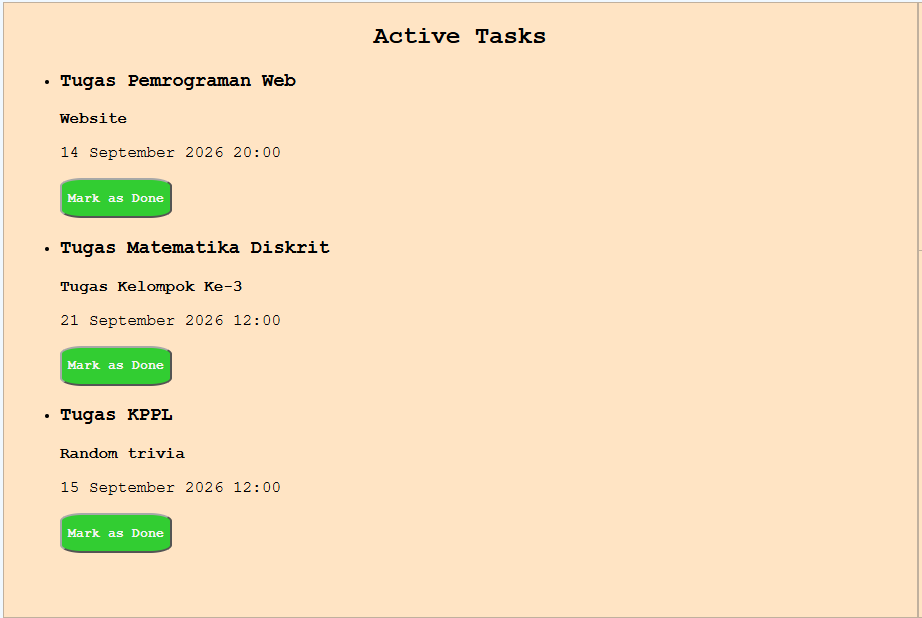
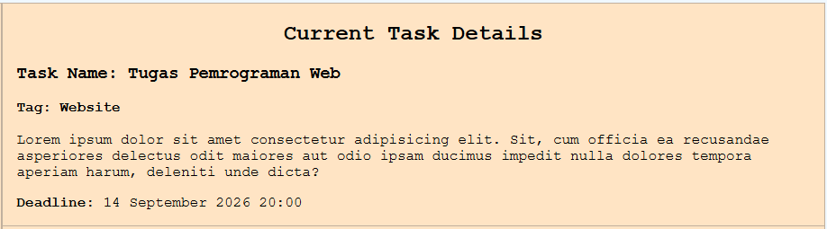
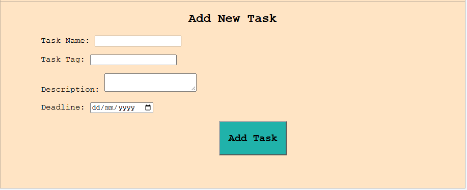

# 5025251068_Todo-App [Task E01a Pemrograman Web A]

## Identitas
|    NRP     |         Nama                 |    Kelas    |
| :--------: | :--------------------------: | :---------: |
| 5025251068 | Satya Mahardika Sandyaditama |      A      |

## Deskripsi Tugas

### Deskripsi Umum

SimplyTodo adalah sebuah website statis yang berbentuk antarmuka manajemen todo list sederhana yang diharapkan dapat membantu pengguna dalam mengatur tugas-tugas yang perlu diselesaikan. Website ini dikerjakan sebagai bagian dari Task E01a kelas Pemrograman Web A.

### Struktur File

- index.html : File html yang berisi struktur DOM dari website.

- style.css : File CSS yang berisi semua styling website ini.

### Struktur Website

#### 1. Header Website

Berupa komponen di sisi atas website yang berisi judul website dan catchphrase website

#### 2. Daftar Tugas (To Do List)

Berupa komponen di sisi kiri website yang menampilkan list tugas yang telah dicatat.

#### 3. Detail Tugas (To Do Details)

Berupa komponen di sisi kanan atas website yang menampilkan detail tugas yang dipilih pengguna saat ini.

#### 4. Form Pencatatan Tugas

Berupa antarmuka form di sisi kanan bawah website yang bertujuan untuk digunakan pengguna menambah tugas baru. 

#### 5. Footer Website

Berupa komponen di bagian bawah website yang berisi detail pembuat website dan keperluan pembuatan website.

## Preview Website

### Preview Umum

#### 1. Mode Desktop

#### 2. Mode Mobile

### Preview Per Komponen Utama

#### 1. Daftar Tugas

#### 2. Detail Tugas

#### 3. Form Pencatatan Tugas

